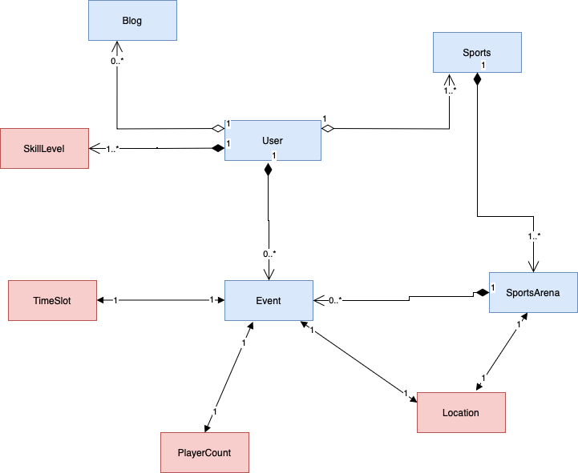

<div align="center">

# 🏅 PlayMate
### *Elevate Your Sporting Experience*

**A full-stack sports community platform where athletes and fitness enthusiasts discover venues, book facilities, join events, and connect — all in one place.**

[](https://react.dev)
[](https://nodejs.org)
[](https://mongodb.com)
[](https://expressjs.com)
[](https://jwt.io)
[](https://developers.google.com/maps)

</div>

---

## 📱 App Preview


---

## 💡 About

PlayMate goes beyond traditional sports apps — it's a full sports and fitness community. Whether you're a fitness fanatic, a competitive athlete, or a casual enthusiast, PlayMate connects you with the venues, events, and people that match your sporting lifestyle.

- 🏟️ Discover and book **sports facilities** near you
- 📅 Create and join **upcoming events**
- ✍️ Share your journey through **community blog posts**
- 👤 Build a **personalized sports profile** with skill levels and preferences
- 🔔 Stay informed with **email notifications** for bookings and updates

---

## ✨ Features

### 🔐 User Authentication
- Secure sign-in with existing credentials or quick account creation
- JWT-based authentication with access, refresh, and reset tokens
- Password reset via secure email link — no security compromise

### 🏠 Home Page
- Clean navbar with quick access to profile, locations, and venues
- Upcoming events section visible on page load
- One-click event creation workflow

### 👤 Personalized Profile
- Register and customize your sports profile
- Add multiple sports with skill level — Beginner, Moderate, or Expert
- Set participation frequency per sport: Daily, Weekly, or Monthly
- Tailored experience based on individual preferences

### 🏟️ Venue Booking
- Discover nearby courts and playgrounds via **Google Maps API**
- View location, sport type, and available time slots
- Book for a specific date and time in just a few clicks
- View and manage **active and past bookings**

### 📅 Upcoming Events
- Browse all upcoming events with date, time, location, and player count
- Expand events to see full details and additional participants
- Create your own events for the community

### ✍️ Blog Posts
- Read community blog posts from fellow athletes
- Write and publish your own posts with title and description
- Share your knowledge, experience, and sporting passion

### 🔔 Email Notifications
- Account registration confirmation
- Password reset link delivery
- Booking confirmation emails

---

## 🏗️ Tech Stack

| Layer | Technology |
|---|---|
| Frontend | React + TypeScript |
| Backend | Node.js + Express.js |
| Database | MongoDB |
| Authentication | JWT (Access + Refresh + Reset tokens) |
| Maps & Location | Google Maps Platform API |
| Email | Nodemailer |
| Architecture | REST APIs + MVC pattern |

---

## 🗂️ Object Model

Domain-driven design was used to model the PlayMate system:



---

## 🚀 Getting Started

### Prerequisites

- Node.js 18+
- MongoDB instance (local or Atlas)
- Google Cloud account with Maps Platform API key

### 1. Clone the repository

```bash
git clone https://github.com/navaleprachi/PlayMate-Web-Application.git
cd PlayMate-Web-Application
```

### 2. Configure environment variables

Create a `config.env` file in the base folder:

```env
PORT=3000
MONGO_URI=your_mongodb_connection_string
ACCESS_SECRET_TOKEN=your_access_token_secret
REFRESH_SECRET_TOKEN=your_refresh_token_secret
RESET_SECRET_TOKEN=your_reset_token_secret
API_KEY=your_google_maps_api_key
```

Generate secure token secrets with:

```bash
node generateSecretKeys.js
```

### 3. Set up your Google Maps API key

1. Create a [Google Cloud account](https://cloud.google.com)
2. Go to **Google Maps Platform → Credentials**
3. Create credentials → **API Key**
4. Enable the **Places Library** in key configuration
5. Paste the key into `config.env` as `API_KEY`

### 4. Install and run the backend

```bash
npm install
npm start
# Backend runs on http://localhost:3000
```

### 5. Install and run the frontend

```bash
cd client/playmate-app
npm install
npm start
# Frontend runs on http://localhost:3001
```

Open [http://localhost:3001](http://localhost:3001) in your browser.

---

## 📡 API Overview

| Resource | Endpoints |
|---|---|
| Auth | Register, Login, Logout, Reset Password |
| Users | Get Profile, Update Profile, Add Sports |
| Venues | List Venues, Search by Location, Get Details |
| Bookings | Create, View Active, View Past, Update |
| Events | List Upcoming, Create Event, Get Details |
| Blogs | List Posts, Create Post, Get Post |

---

## 👥 Team

| Name | NEU ID | Email |
|---|---|---|
| Prachi Navale | 002294846 | navale.p@northeastern.edu |
| Nilraj Mayekar | 002866076 | mayekar.n@northeastern.edu |
| Anirudh Maheshwari | 002851954 | maheshwari.ani@northeastern.edu |
| Puja Kalivarapu | 002830506 | kalivarapu.p@northeastern.edu |

---

## 👩‍💻 Author

**Prachi Navale** — Frontend Engineer · MS Information Systems, Northeastern University

[](https://www.linkedin.com/in/prachi-navale/)
[](https://prachinavale-portfolio.netlify.app/)
[](https://github.com/navaleprachi)

---

<div align="center">
  <i>Built for athletes, fitness enthusiasts, and everyone who believes movement is a lifestyle.</i>

  <br/><br/>
 
  Copyright © 2024 Prachi Navale · All rights reserved.
</div>
